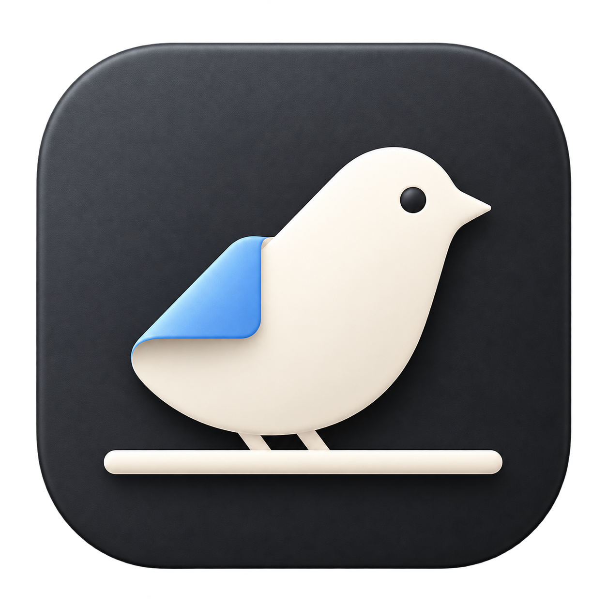
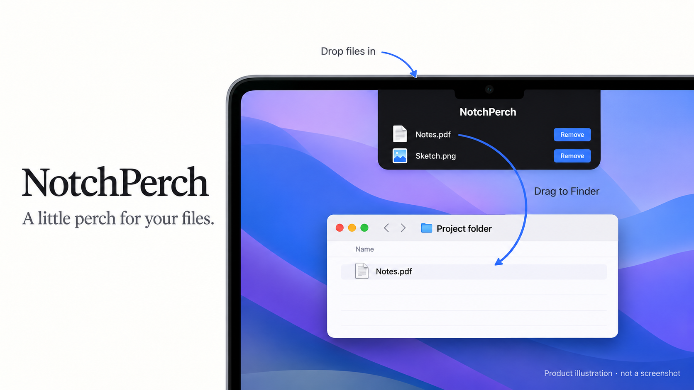

<p align="center">
  
</p>

<h1 align="center">NotchPerch</h1>
<p align="center"><strong>A little perch for your files.</strong><br>A native macOS file shelf that opens from your camera notch.</p>
<p align="center">macOS 13+ · Apple silicon · Swift / AppKit · Prototype</p>



*Illustration of the intended workflow, generated for this README. This is not an application screenshot; layout details may differ.*

## What it does

NotchPerch gives files a temporary place at the top of your screen while you work between folders. It stores references to your files rather than importing them into a separate library.

1. **Hover over the notch** to reveal the shelf.
2. **Drop files onto it** to keep their references within reach.
3. **Drag a file to Finder** to request a move to your chosen folder.

The shelf hides after the pointer leaves. Its expansion respects macOS Reduce Motion. A menu bar item lets you show the shelf, toggle launch at login, or quit.

**Remove clears a shelf reference only.** It does not delete the original file. Dragging a file out uses a different operation: NotchPerch writes and checks the destination before removing the source to complete a move.

## Download the app

[**Download NotchPerch 0.1.0 for Apple silicon**](https://github.com/davidebellia/notch_perch/releases/download/v0.1.0/NotchPerch-0.1.0-macOS-arm64.zip) · [Release notes and checksum](https://github.com/davidebellia/notch_perch/releases/tag/v0.1.0)

Unzip the download, move **NotchPerch.app** to Applications, and launch it. Requires macOS 13 or later on an Apple silicon Mac. This is a prototype with an ad hoc signature, without Apple notarization; macOS may block opening it. The release page explains its development-build status. GitHub's automatically generated source archives contain code, not the compiled app.

## Build from source

Requires an Apple silicon Mac running macOS 13 or later and Apple's Command Line Tools (`xcode-select --install`). The current build script targets `arm64`; an Intel build is not supplied. No third-party packages, API keys, or backend services are required.

```sh
git clone https://github.com/davidebellia/notch_perch.git
cd notch_perch
./build-app.sh
open build/NotchPerch.app
```

The script compiles the app, generates its icon, and signs the bundle locally with an ad hoc signature. This is a development build, without Developer ID signing or notarization.

On displays without a detectable camera notch, automatic hover opening is disabled; use the menu bar item to show the shelf.

## File moves and prototype status

Drag-out currently supports regular files only, excluding directories and symbolic links. The app uses AppKit file promises, checks the destination and source contents, and creates a temporary recovery file before source removal. A committed move removes the shelf reference. Cancellation, conflicts, changed sources, and errors retain the reference and report the outcome. An unsuccessful move can leave a destination copy or recovery file; check the displayed notice before retrying.

The supplied fixture suite covers successful moves and failure paths. The release workflow successfully built the app on macOS, verified its ad hoc signature and bundle metadata, and ran the fixture suite before publishing the download. Real Finder drag-and-drop, hover behavior, animation, cross-volume moves, and launch at login still need end-to-end validation. Use disposable files when evaluating the prototype.

## Project structure

```text
Assets/                 Original app icon
Sources/NotchPerch/      AppKit interface, shelf state, and file transfers
Tests/                  File-transfer fixture suite
docs/                   Development guide and product illustration
build-app.sh            App compilation and local signing
build-icon.sh           macOS icon generation
```

Generated bundles and macOS metadata are ignored by Git.

## Development and contributions

See the [development guide](docs/development.md) for architecture, tests, and a manual verification checklist. See [CONTRIBUTING.md](CONTRIBUTING.md) for bug reports and proposed changes.

The app was previously named Drop. Its bundle identifier remains `dev.local.drop` and its preference key remains `shelfItemPaths` to preserve existing shelf references. The application is named **NotchPerch** and its repository is **notch_perch**.

## License

[MIT](LICENSE).
