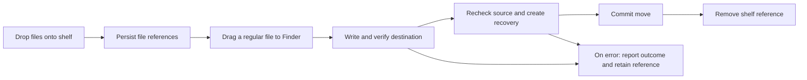

# Development guide

## Requirements

- macOS 13 or later on Apple silicon.
- Apple Command Line Tools with `swiftc`, `sips`, `iconutil`, and `codesign`.
- A logged-in graphical macOS session for AppKit execution and interactive checks.

This project has no package dependencies or backend services. Linux does not provide AppKit, ServiceManagement, or Apple's icon and signing tools, so it cannot build or run the application or its existing tests.

## Build

From the repository root:

```sh
./build-app.sh
codesign --verify --deep --strict build/NotchPerch.app
open build/NotchPerch.app
```

`build-icon.sh` derives the standard icon sizes from `Assets/AppIcon.png`. The scripts place generated output in `build/` and use temporary directories under `/private/tmp`. Build output is not versioned.

The app is locally ad hoc signed. Developer ID signing, notarization, release packaging, and Intel compatibility are not configured.

## Architecture

| File | Responsibility |
| --- | --- |
| `Sources/NotchPerch/main.swift` | App lifecycle, menu bar item, notch detection, animated panel, file rows, drag interactions, and login-item integration. |
| `Sources/NotchPerch/ShelfCore.swift` | Shelf references, deduplication, transfer notices, and UserDefaults persistence. |
| `Sources/NotchPerch/VerifiedFileMove.swift` | AppKit file promises, destination checks, source coordination, recovery creation, and move outcomes. |
| `Tests/VerifiedFileMoveTests.swift` | Disposable file fixtures and injected failures for the transfer implementation. |



The diagram summarizes the intended successful path and error reporting. It is not proof that every filesystem or Finder interaction has been validated. Check the implementation and fixtures when changing transfer behavior.

## Fixture tests

The suite is a standalone AppKit executable rather than an XCTest or Swift Package target. Compile it separately from the application's `main.swift`. From the repository root on macOS:

```sh
mkdir -p build/tests /private/tmp/notchperch-swift-cache
swiftc -module-cache-path /private/tmp/notchperch-swift-cache \
  -parse-as-library -target arm64-apple-macosx13.0 \
  Sources/NotchPerch/ShelfCore.swift \
  Sources/NotchPerch/VerifiedFileMove.swift \
  Tests/VerifiedFileMoveTests.swift \
  -framework AppKit -o build/tests/VerifiedFileMoveTests
./build/tests/VerifiedFileMoveTests
```

A successful run prints `VerifiedFileMoveTests passed`. Unhandled failures exit unsuccessfully; failed assertions terminate the executable. The runner also writes `/private/tmp/drop-verified-move-tests-result.txt` (the legacy filename is retained). Treat that file as evidence only when its timestamp belongs to the current run, and check the process exit status. Do not run parallel copies of this runner, since they share that result path.

Fixtures use a temporary directory and an isolated UserDefaults domain. The suite covers commits, cancellation, destination conflicts, same-path rejection, source changes, already-moved sources, unaccepted final operations, recovery fallback failures, source-removal failures, rollback, long Unicode filenames, and persisted references.

These commands are provided for macOS development and have not been executed in the Linux environment used to prepare this repository. Fixture success does not validate a real Finder drag.

## Manual verification

Use disposable files in temporary folders and verify contents at both source and destination after each operation.

- Open and close the shelf by hovering over a physical notch; confirm nearby menu items remain accessible.
- Drop a fixture onto the shelf and confirm its reference survives an app restart.
- Press Remove and confirm the original file remains unchanged.
- Drag a fixture to Finder; check destination contents, source removal, and shelf-reference removal after success.
- Cancel a drag and test an existing destination filename; confirm the original is preserved.
- Exercise long filenames and a separate-volume destination.
- Check Reduce Motion and launch-at-login behavior.

Real Finder transfers, hover and animation, cross-volume behavior, and launch at login remain outstanding validation areas.

## Visual assets

`Assets/AppIcon.png` is the original bird icon supplied with the project; it was created with image generation tools. `docs/images/notchperch-overview.png` is a generated product illustration for the README, not a captured application screenshot. Replace or supplement it with verified screenshots when available.
